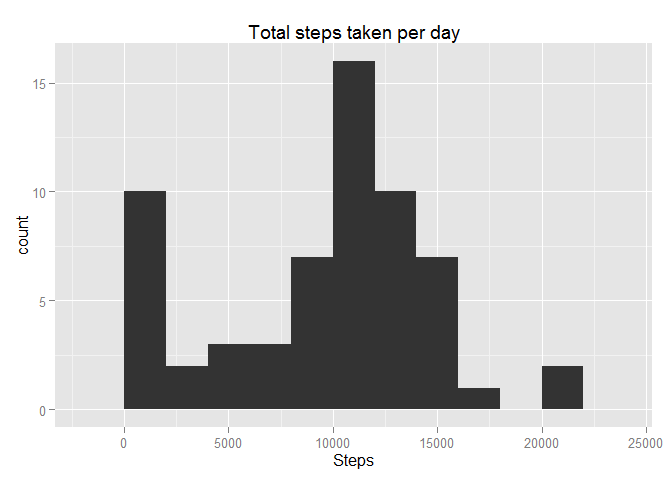
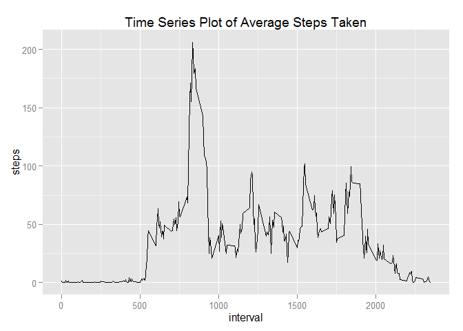
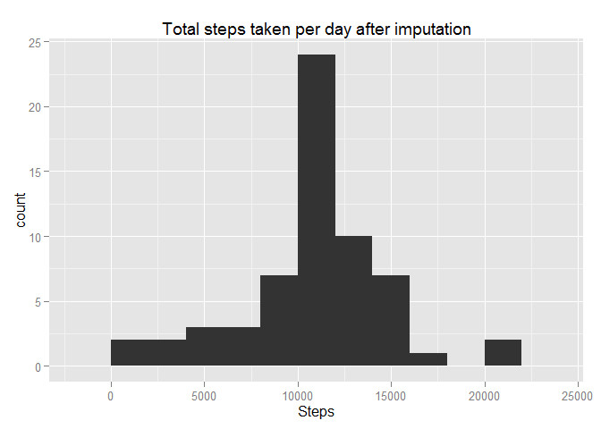
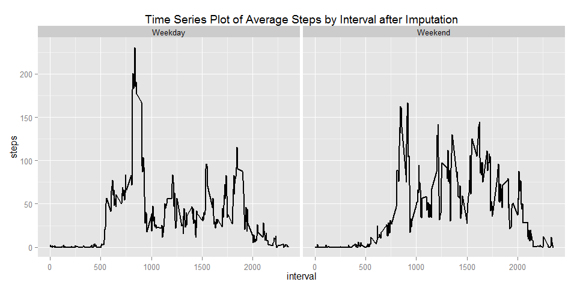

# Reproducible Research: Peer Assessment 1


## Loading and preprocessing the data


```r
unzip(zipfile = "activity.zip")
data <- read.csv("activity.csv")
data$date <- as.Date(data$date)
```


## What is mean total number of steps taken per day?

Plot histogram of total number of steps taken per day

```r
library(ggplot2)
```

```
## Warning: package 'ggplot2' was built under R version 3.1.2
```

```r
totalsteps <- aggregate(x = data$steps , by = list(data$date), FUN = sum ,na.rm=TRUE)
names(totalsteps) <- c("date","steps")
histplot <- ggplot(totalsteps,aes(x = steps)) +
            ggtitle("Total steps taken per day") +
            xlab("Steps") +
            geom_histogram(binwidth = 2000)
histplot
```

 

Compute mean number of steps taken per day

```r
mean(totalsteps$steps , na.rm = TRUE)
```

```
## [1] 9354.23
```

Compute median number of steps taken per day

```r
median(totalsteps$steps , na.rm = TRUE)
```

```
## [1] 10395
```


## What is the average daily activity pattern?

Plot time series of 5-minute interval and the average number of steps taken, averaged across all days

```r
avgsteps  <- aggregate(x = data$steps , by = list(data$interval), FUN = mean ,na.rm=TRUE)
names(avgsteps) <- c("interval","steps")

avgstepsline <- ggplot(avgsteps,aes(interval,steps)) +
                 ggtitle("Time Series Plot of Average Steps Taken") +
                 geom_line()
avgstepsline  
```

 

5-min time interval containing most number of steps

```r
avgsteps[which.max(avgsteps$steps),c("interval")]
```

```
## [1] 835
```


## Imputing missing values

Total number of missing values

```r
nrow(data[is.na(data$steps),])
```

```
## [1] 2304
```

Imputing missing step values with mean step

```r
dataimputed <- merge(x = data, y = avgsteps, by = "interval", all.x = TRUE)
dataimputed[is.na(dataimputed$steps.x),c("steps.x")] <- dataimputed[is.na(dataimputed$steps.x),c("steps.y")]
```

Cleaning new dataset

```r
dataimputed$date <- as.Date(dataimputed$date)
dataimputed$date.x <- NULL
dataimputed$Group.1 <- NULL
dataimputed$steps <- dataimputed$steps.x
dataimputed$steps.x <- NULL
dataimputed$steps.y <- NULL
```

Plot histogram with new dataset

```r
newtotalsteps <- aggregate(x = dataimputed$steps , by = list(dataimputed$date), FUN = sum ,na.rm=TRUE)
names(newtotalsteps) <- c("date","steps")
histplot <- ggplot(newtotalsteps,aes(x = steps)) +
            ggtitle("Total steps taken per day after imputation") +
            xlab("Steps") +
            geom_histogram(binwidth = 2000)
histplot 
```

 

Compute new mean number of steps taken per day

```r
mean(newtotalsteps$steps , na.rm = TRUE)
```

```
## [1] 10766.19
```

Compute new median number of steps taken per day

```r
median(newtotalsteps$steps , na.rm = TRUE)
```

```
## [1] 10766.19
```

## Are there differences in activity patterns between weekdays and weekends?

Factor variables indicating a weekday or weekend

```r
dataimputed$weekday <- as.factor(ifelse(weekdays(dataimputed$date) %in% c("Saturday","Sunday"), "Weekend", "Weekday")) 
```

Plot panel time series of the 5-minute interval and the average number of steps taken, averaged across all weekday days or weekend days.

```r
avgstepsweekday  <- aggregate(x = dataimputed$steps , 
                                                    by = list(dataimputed$interval,dataimputed$weekday), FUN = mean ,na.rm=TRUE)
names(avgstepsweekday) <- c("interval","weekday","steps")

avgstepsline2 <- ggplot(avgstepsweekday,aes(interval,steps)) +
                 ggtitle("Time Series Plot of Average Steps by Interval after Imputation") +
                 facet_grid(. ~ weekday) +
                 geom_line(size = 1)
avgstepsline2  
```

 
